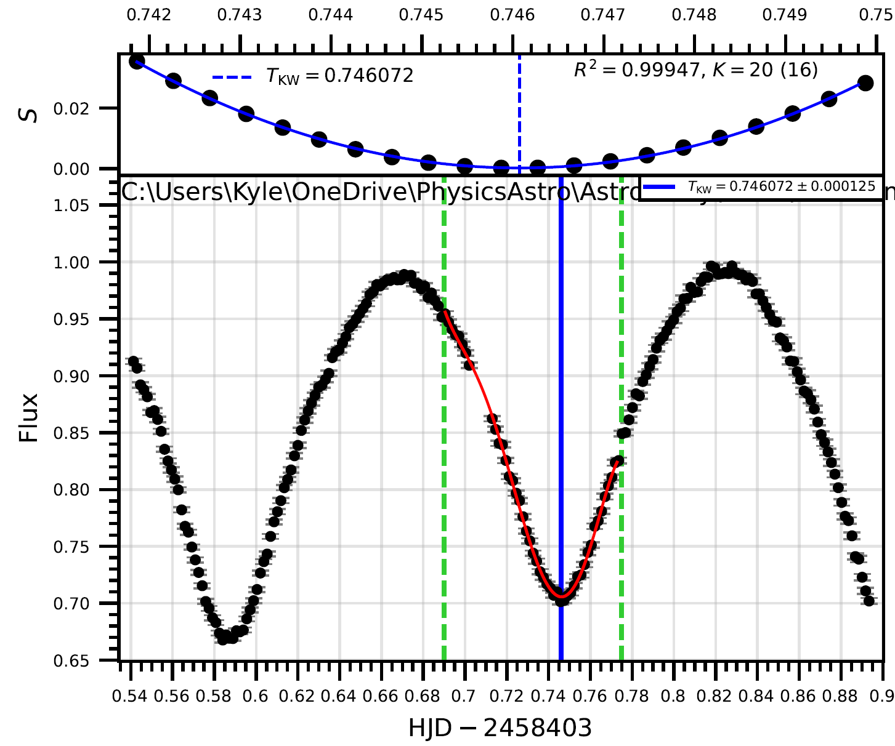
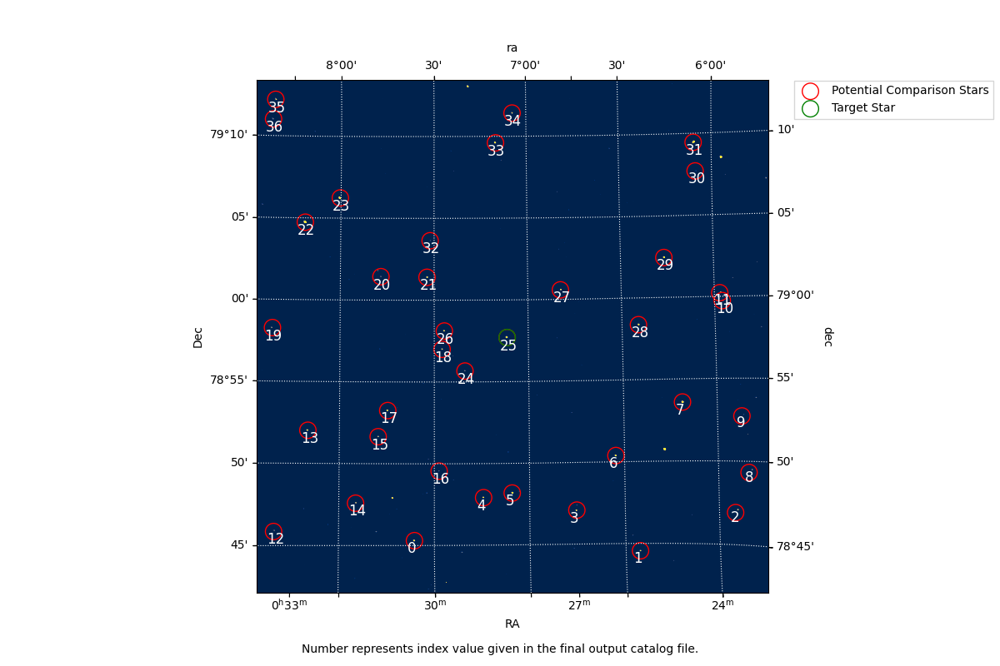
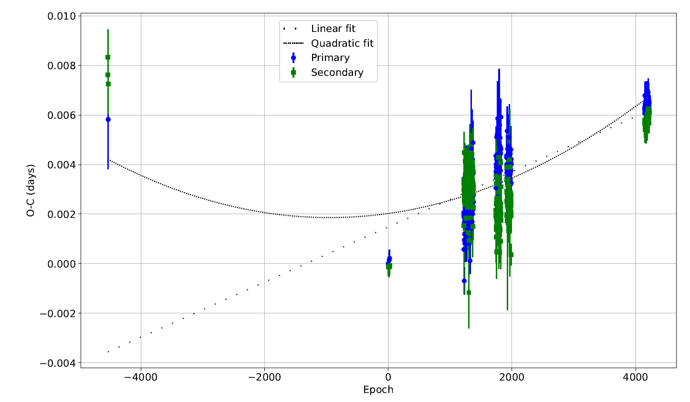
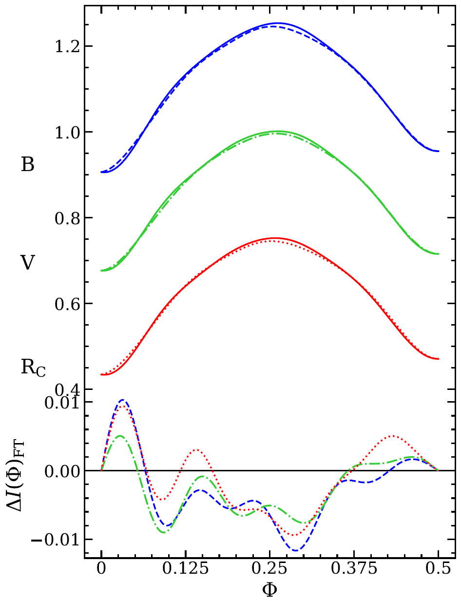
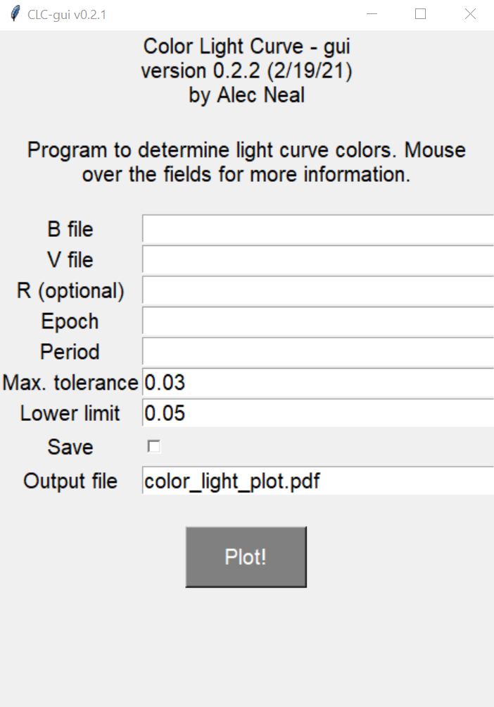
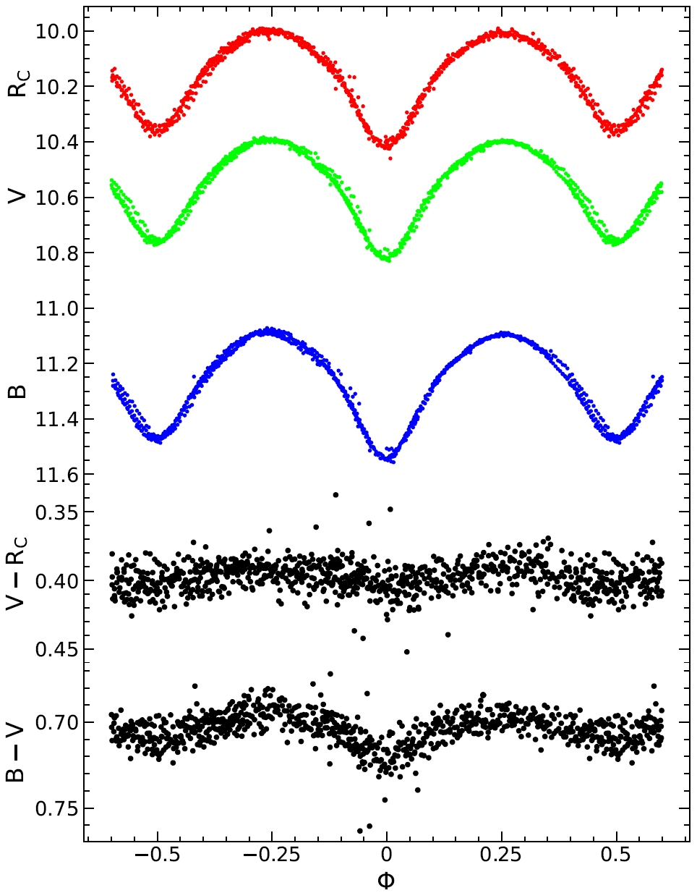
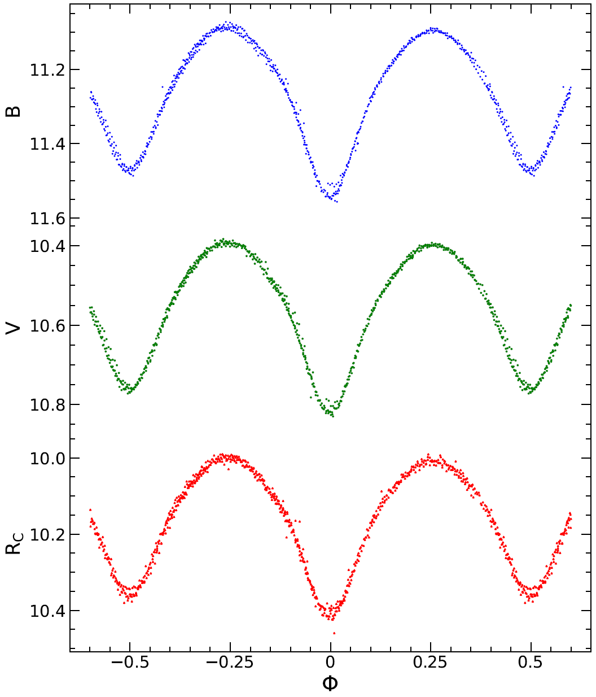

.. _toolbox:

Program Options
===============

.. Important::
    This documentation is not meant to go over all the physics/astronomy or background knowledge required to fully understand what the various programs are doing.

Menu
----

After running the main script as described `here <https://eclipsingbinaries.readthedocs.io/en/latest/EB.html>`_. The user will be tasked with selecting different programs to run which is run by the ``menu.py`` file.

The various programs to choose from are:

+ IRAF Reduction
+ Find Minimum
+ TESS Database Search/Download
+ AIJ Comparison Star Selector
+ BSUO or SARA/TESS Night Filters
+ O-C Plotting
+ Gaia Search
+ O'Connell Effect
+ Color Light Curve
+ Close Program

IRAF Reduction
--------------

.. note::
    The pipeline for this program is setup only for use at BSUO. This will be updated in the future.

Making heavy use of `Astropy's ccdproc <https://ccdproc.readthedocs.io/en/stable/ccddata.html>`_ and `Photutils <https://photutils.readthedocs.io/en/stable/aperture.html>`_ I was able to create an automatic data reduction process using Bias, Darks, and Flats to reduce science images.

The first thing that is done is set some global variables:

.. literalinclude:: ../EclipsingBinaries/IRAF_Reduction.py
   :lines: 32-40

If the user is using the ``pipeline`` as described in this `section <https://eclipsingbinaries.readthedocs.io/en/latest/pipeline.html>`_ then the following lines of code are used:

.. literalinclude:: ../EclipsingBinaries/IRAF_Reduction.py
   :lines: 110-141

Otherwise, these lines are used from the ``main`` function:

.. literalinclude:: ../EclipsingBinaries/IRAF_Reduction.py
   :lines: 55-108

The only functional difference in these lines of code, is with the ``pipeline`` the user does not have to enter in folder and file locations manually where not using the ``pipeline`` the user does.

Default Values
^^^^^^^^^^^^^^

If the user is not using the ``pipeline`` and is not at the ``BSUO`` location, then the user has the option to change those initial global settings with this function:

.. literalinclude:: ../EclipsingBinaries/IRAF_Reduction.py
   :lines: 189-217

Where the default value is displayed but the user can change them to whatever value they like. There are no ``try excepts`` to catch incorrect ``types`` so the user has to be extra careful when entering in values.

Reduction Functions
^^^^^^^^^^^^^^^^^^^

Main functions of this program are ``bias``, ``dark``, ``flat``, and ``science``. Howeverm they all call this function for the actual data reducing of each image:

.. literalinclude:: ../EclipsingBinaries/IRAF_Reduction.py
   :lines: 220-289

Each process of reducing bias, darks, flats, and science image has its own section within the if statement.

Bias
^^^^

The bias function as shown below, first takes a flat image from the raw folder (when not using the pipeline) and displays it for the user to see:

+ If there is an overscan region
+ Where the data section (trim region) is

The format for both of these variables is [columns, rows] as is the fits convention. However, if the user does not want to use all of the columns like for an overscan region, then an example would be this ``[2073:2115, :]``. Where the only columns used are between 2073 and 2115 but all of the rows are being used. Likewise, an example trim region would be ``[20:2060, 12:2057]``. This example uses columns 20-2060 and rows 12-2057.

For ``ccdproc``, there is a weird bug where if the user enters the same rows for an overscan region and trim region, ``ccdproc`` errors out. So the recommendation is to use all of the rows for an overscan region and then specify where the user wants to trim the image after.

Once the each image has been reduced, they must be combined to create what is called a ``master bias`` or ``zero`` image. This is done specifically by these lines:

.. literalinclude:: ../EclipsingBinaries/IRAF_Reduction.py
   :lines: 354-360

The ``sigma_clip_dev_func`` computes the standard deviation about the center value (see `here <https://ccdproc.readthedocs.io/en/stable/api/ccdproc.Combiner.html#ccdproc.Combiner.sigma_clipping>`_ for more details regarding this). Also, the ``mem_limit`` can be changed but is set toa  default value of 16 Gb (1600e6). This might need to be reduced to be between 6 and 10 Gb as the average RAM is now 16 Gb. The purpose of this value is to aim to reduce and split the task of combining into chunks to reduce system RAM usage.

.. literalinclude:: ../EclipsingBinaries/IRAF_Reduction.py
   :lines: 292-370

Dark
^^^^

Once the ``zero`` image has been created, the next step of the process is to create a ``master_dark``. However, some researchers forgo taking dark images as CCD's are cooled down so much that the thermal noise created by them in darks is virtually negligible and this is why there is a variable called ``dark_bool`` which has a default value of ``True``.

The process is the exact same as above for Bias except, the ``zero`` image is subtracted off each and every dark image. The combining of these newly reduced darks is also slightly different:

.. literalinclude:: ../EclipsingBinaries/IRAF_Reduction.py
   :lines: 393-441

As we now have to take into consideration the ``read nooise`` and ``gain`` of the CCD/camera.

Flat
^^^^

As stated above, the process is virtually the same but now the ``zero`` and ``master dark`` are both subtracted off each and every flat image. Now the combining of the images is slightly different as we now have filters.

.. literalinclude:: ../EclipsingBinaries/IRAF_Reduction.py
   :lines: 477-487

This created ``master flats`` in each filter that the user is using.

Science
^^^^^^^

Again as stated above, the ``zero`` and ``master dark`` are subtracted from each science image and the ``master flats`` are used based on the filter used for each science image.

Adding to the Header
^^^^^^^^^^^^^^^^^^^^

Each of the previous four functions discussed all call the ``add_header`` function within the reduction loops. This function adds various values to the headers of each individual image:

.. literalinclude:: ../EclipsingBinaries/IRAF_Reduction.py
   :lines: 531-568

The goal of this is to make it easier in the future to tell what values were used in the reduction process.

BJD_TDB
^^^^^^^

The conversion between ``HJD`` and ``BJD_TDB`` is not an easy conversion. The purpose of including this in this package is to have a single time value across multiple telescopes or satellites. `TESS <https://tess.mit.edu/>`_ uses ``BJD_TDB`` while BSUO and various `SARA <https://www.saraobservatory.org/>`_ use ``HJD``.

.. literalinclude:: ../EclipsingBinaries/IRAF_Reduction.py
   :lines: 571-592

Find Minimum
------------

.. note::
    This program was originally created by Alec J. Neal but updated for interactive usage by Kyle J. Koeller.

This program aims to find the times of minimum (ToM) from given light curve data. One thing this helps with is determine how accurate the period is.

The ``main`` function first asks the user how many filters they are using. Again this is assumed to be between 1-3 fiflters as that is what is used for BSUO and the SARA telescopes that Ball State has access to.

.. literalinclude:: ../EclipsingBinaries/find_min.py
   :lines: 552-594

Kwee van Woerdan
^^^^^^^^^^^^^^^^

Any option that the user enters, the function ``plot_obs`` is called. The point of this function is to plot the main figure that the user interacts with varying keyboard press events (talk about that later). Within this function, the function ``KvW`` (Kwee van Woerdan) is called. This is a method utilizes the symmetry of a light curve to use an estimated location.

The ToM and its error is defined by the following:

.. literalinclude:: ../EclipsingBinaries/find_min.py
   :lines: 160-182

Key Events
^^^^^^^^^^

When the plot gets displayed to the user, the user can interactively work with what is displayed using various key presses:

.. literalinclude:: ../EclipsingBinaries/find_min.py
   :lines: 459-507

This functionaility is still a work in progress but the user can do the following:

+ Left and right boundaries
+ Move to the next "day" (next set of observations)
+ Close the plot
+ Display the options available

The ability to write the KvW value and error to a file will be added at a later date.

TESS Database Search/Download
-----------------------------

Searching the TESS Database allows for even more data collection than what is availabe through telescope time. TESS is a great resource because if a user's target object is in the database there is most likely a couple of months worth of data as TESS looks at the same spot in the sky for 27 days straight without stopping collecting data.

Searching TESS
^^^^^^^^^^^^^^

Given an object's name, the program will find sector numbers (the number of the month data was taken). If there are no sectors available for a particular star then the program will ask the user for another star name.

.. literalinclude:: ../EclipsingBinaries/tess_data_search.py
   :lines: 29-36

TESS ccd Information
^^^^^^^^^^^^^^^^^^^^

TESS released information regarding its ccd's (there are four on board the satellite) and this is compiled into a text file called ``tess_ccd_info.txt`` located `here <https://github.com/kjkoeller/EclipsingBinaries/blob/main/EclipsingBinaries/tess_ccd_info.txt>`_ for reference. The program determined the gain given the sector's camera and ccd values and only takes every 4th value given repeats.

.. literalinclude:: ../EclipsingBinaries/tess_data_search.py
   :lines: 49-70

Downloading
^^^^^^^^^^^

Starting the downloading after finding sector numbers is as simple as telling the program to download all the sectors for a first time run or to download a specific sector for new data release.

.. literalinclude:: ../EclipsingBinaries/tess_data_search.py
   :lines: 80-103

For either choice, the program calls the ``download`` function. This function actively retrieves the data based on system name and sector number.

.. literalinclude:: ../EclipsingBinaries/tess_data_search.py
   :lines: 108-131

The default size is the maximum size allowed by TESS which is a ``30x30 arcmin`` box. At this current time, there is no way to change this as an input, but if users are wanting this choice, this can be added at a later date.

TESSCut
^^^^^^^

At the line ``tCut(manifest, download_path)``, the program calls a new file named ``tesscut.py``. The reason for this file is to "unzip" the downloaded file from TESS. TESS outputs a fits file that has all images for a given sector inside of this.

The extraction process is handled by this file and looks at the metadata of each extracted image to gather the mid exposure time in ``BJD_TDB`` at which that image was taken:

.. literalinclude:: ../EclipsingBinaries/tesscut.py
   :lines: 97-98

.. literalinclude:: ../EclipsingBinaries/tesscut.py
   :lines: 110

BJD to HJD
^^^^^^^^^^

Converting from ``BJD_TDB`` to ``HJD`` is handled by the following function:

.. literalinclude:: ../EclipsingBinaries/tesscut.py
   :lines: 146-156

Takes a ``RA, DEC, BJD_TDB, location`` as inputs and finds the light travel time corrected ``HJD``. Currently the light travel time is not fully correct as it uses ``Greenwich England`` as the location but should be using the TESS satellite location. This will hopefully be added at a later date but is not a priority as the effect will be minimal.

Header Information
^^^^^^^^^^^^^^^^^^

Lastly there are a few header updates that are added to each image as denoted by the following lines:

.. literalinclude:: ../EclipsingBinaries/tesscut.py
   :lines: 128-132

The value ``LST_UPDT`` is when the file was edited by this program and the ``COMMENT`` is some information about the image like: date image was taken, sector number, etc.

AIJ Comparison Star Selector
----------------------------

Catalog Finder
^^^^^^^^^^^^^^

The first thing this program does is search the `Vizier APASS catalog <https://vizier.cds.unistra.fr/viz-bin/VizieR-3?-source=II/336/apass9&-out.max=50&-out.form=HTML%20Table&-out.add=_r&-out.add=_RAJ,_DEJ&-sort=_r&-oc.form=sexa>`_. Given a ``RA`` and ``DEC`` of a star, the program does the following:

.. literalinclude:: ../EclipsingBinaries/apass.py
   :lines: 213-221

This looks at a box of size 30 arcmin and gathers all APASS magnitude known stars and compiles them into a table. The first three inputs into the result variable are:

+ ``columns`` Defines what to gather from the catalog database
+ ``row_limit`` Set to ``-1`` to have no row limit (i.e. gather as many objects as possible)
+ ``column_filters`` Only gather data on the stars with Johnson B and V magnitudes less than 14

Cousins R
^^^^^^^^^

.. note::
    Utilizes GPU accleration through ``numba`` for the ``calculations`` function.

After gathering all the comparison stars, the program then goes on to calculate the Cousins R band filter. For each and every comparison star by calling the ``calculations`` function:

.. literalinclude:: ../EclipsingBinaries/apass.py
   :lines: 448-483

The final equation used comes from this `paper <https://arxiv.org/pdf/astro-ph/0609736.pdf>`_ by rearranging equation 2 to solve for the Cousins R variable. The error for the ``val`` is given by the variable ``root`` and this uses basic add the errors in quadrature.

.. literalinclude:: ../EclipsingBinaries/examples/APASS_Catalog_ex.txt
    :lines: 1-10

Gaia
^^^^

The ``cousins_r`` function also searches the `Gaia <https://www.cosmos.esa.int/web/gaia/data-release-3>`_ catalog by calling the ``gaia.py`` file and specifically the ``tess_mag`` function. The function takes numerous Gaia magnitude values and calculates the TESS magnitude. Here are a number of papers on the subject:

+ https://iopscience.iop.org/article/10.3847/1538-3881/acaaa7/pdf
+ https://iopscience.iop.org/article/10.3847/1538-3881/ab3467/pdf
+ https://arxiv.org/pdf/2012.01916.pdf

.. literalinclude:: ../EclipsingBinaries/gaia.py
   :lines: 128-160

If the value of the TESS magnitude for a given comparison is ``NaN`` then the value and its error are set to ``99.999`` to effectively guarantee that it will not be used later.

Creating RADEC Files
^^^^^^^^^^^^^^^^^^^^

The creation of RADEC files is carried out by the function ``create_radec`` and it uses Astro ImageJ (AIJ) convention of formatting these files:

.. literalinclude:: ../EclipsingBinaries/apass.py
   :lines: 304-378

The function creates four RADEC files for each main filter used by BSUO (Johnson B, Johnson V, and Cousins R) and writes them to individual files.

Overlay
^^^^^^^

Displaying where all the comparison stars are located is optional. The function ``overlay`` takes the list of RA and DEC of the comparison stars and overlays their locations onto an image that the user enters in. The program plots circles around the stars and numbers them underneath those circles.

.. literalinclude:: ../EclipsingBinaries/apass.py
   :lines: 427-444

BSUO or SARA/TESSS Night Filters
--------------------------------

Gather Data
^^^^^^^^^^^

When using Astro ImageJ (AIJ) produces ``.dat`` files that contain magntiude and flux data for every set of data anlyzed. The purpose of this code is to take all sets of the data files and combine them into a single file per filter, from the ``Night_Filters.py`` program.

The program first checks how many nights the use will be using and then gathers each file pathway from a for loop inside the ``get_nights_AIJ`` function. 

.. literalinclude:: ../EclipsingBinaries/Night_Filters.py
   :lines: 86-162

The program checks if the user has both magnitude and flux data or just magnitude data by checking if there five or seven columns in the ``.dat`` files. Once that has been determined the program then writes those values into a text file:

.. literalinclude:: ../EclipsingBinaries/Night_Filters.py
   :lines: 163-195

.. literalinclude:: ../EclipsingBinaries/examples/test_B.txt
    :lines: 1-10

.. note::
    The same thing happens for TESS data (``get_nights_TESS.py`` function) except at the time or writing this program (1-30-2023), BSUO only had the ablity to gather relative flux data but now with the ``gaia.py`` program, this needs to be updated to gather magnitude data as well.

O-C Plotting
------------

Calculating Observed minus Calculated (O-C) is done by the ``OC_plot.py`` prigram. Given a period and first primary ToM the program calculates the O-C values and respctive errors. The program first asks the user if they are calculating BSUO/SARA data, TESS data, or plotting all their data.

BSUO/SARA
^^^^^^^^^

.. literalinclude:: ../EclipsingBinaries/OC_plot.py
   :lines: 34-56

As seen above, the program asks the user if they know what their ``T0`` and ``To_err`` and if they don't then the program calls the ``arguments`` function:

.. literalinclude:: ../EclipsingBinaries/OC_plot.py
   :lines: 286-300

For each index value for each filter, the ToM are averaged together. This gives the user the most likely time for that ToM:

.. literalinclude:: ../EclipsingBinaries/OC_plot.py
   :lines: 159-162

Calculations
^^^^^^^^^^^^

After that, the programs calls the ``BSUO`` function which then calls the ``calculate_oc`` function that does the real calculations:

.. literalinclude:: ../EclipsingBinaries/OC_plot.py
   :lines: 303-332

The very first line of the above code is utilizing the `Numba <https://numba.pydata.org/>`_ package. The following lines are what calculate the eclipse number and if the ``E_act`` is positive then use the floor function and if ``E_act`` is negative use the ceiling function. The ``OC`` and ``OC_err`` only take the first five decimal places, otherwise there would be like 10 decimal places (unrealistic accuracy).

.. literalinclude:: ../EclipsingBinaries/examples/example_OC_table.txt
    :lines: 1-10

TESS
^^^^

The only difference between BSUO/SARA to TESS data is that, TESS assumes only a single filter. So there is no averaging for the ToM to be done.

Plotting All Data
^^^^^^^^^^^^^^^^^

.. note::
    The format for all data files must follow the format as seen in this `example_OC_table.txt <https://github.com/kjkoeller/EclipsingBinaries/blob/main/EclipsingBinaries/examples/example_OC_table.txt>`_.

Once all calculations have been done through ``OC_plot.py`` or elsewhere, the program allows the user to plot all their data together. The program will first create a table that turns the input file into a ``.tex`` file that is formatted automatically to be turned into a paper ready table.

.. literalinclude:: ../EclipsingBinaries/OC_plot.py
   :lines: 244-271

.. literalinclude:: ../EclipsingBinaries/examples/O-C_paper_table.txt

Weights are calculated by this line:

.. literalinclude:: ../EclipsingBinaries/OC_plot.py
   :lines: 356

The program splits up the primary and secondary ToM to help show potential trends and the plotting occurs with these lines:

.. literalinclude:: ../EclipsingBinaries/OC_plot.py
   :lines: 456-457

When plotting the qudratic and linear fits, the program also produces a text file that shows the Least Squares fit for both fits. This file is also made to be used in a paper and is formatted in latex automatically.

.. literalinclude:: ../EclipsingBinaries/examples/example_regression.txt
    :lines: 1-32

Gaia Search
-----------

Query
^^^^^
Some of the Gaia (``gaia.py``) has already been described in the `AIJ Comparison Star Selector Section <https://eclipsingbinaries.readthedocs.io/en/latest/toolbox.html#gaia>`_, but the other functionality of this program is to find parallax, effective temperature, radial velocity, and various Gaia mangitude data for a target star.

The query comes from the package ``pyia`` and the function ``GaiaData``:

.. literalinclude:: ../EclipsingBinaries/gaia.py
   :lines: 40-61

Then all that information gets saved to a text file with the name entered by the user:

.. literalinclude:: ../EclipsingBinaries/gaia.py
   :lines: 64-88

.. literalinclude:: ../EclipsingBinaries/examples/Gaia_output.txt

O'Connell Effect
----------------

.. note::
    Based on this `paper <https://app.aavso.org/jaavso/article/3511/>`_ and originally created by Alec J. Neal, the program ``OConnell.py`` solves various statistical anlalyses in regards to the O'Connell effect.

Data
^^^^

The program first tasks the user with entering in light curve data for 1-3 filters (Johnson B, Johnson V, and Cousins R). Which then calls the function ``multi_OConnell_total`` and there are options for one or two filters as well.

.. literalinclude:: ../EclipsingBinaries/OConnell.py
   :lines: 38-53

Calculations
^^^^^^^^^^^^

After the files have been entered, the program converst the magnitude data into flux data and finds the phase at which each data point occurs from the period:

.. literalinclude:: ../EclipsingBinaries/OConnell.py
   :lines: 113-120

Then plots the first half of the light curve flux on top of the second half light curve and finds the difference.

.. literalinclude:: ../EclipsingBinaries/OConnell.py
   :lines: 126-137

Once this gets plotted the program then finds the various statistical values and adds them to a list for each filter.

.. literalinclude:: ../EclipsingBinaries/OConnell.py
   :lines: 415-433

.. literalinclude:: ../EclipsingBinaries/OConnell.py
   :lines: 298-328

See `vseq_updated.py <https://github.com/kjkoeller/EclipsingBinaries/blob/main/EclipsingBinaries/vseq_updated.py#L1114>`_ for the actual calculations of all the values.

Output
^^^^^^

Once the program goes through all the filters, it then creates a latex ready file for use in a paper with a table of all filters along with their respctive statistical values.

.. literalinclude:: ../EclipsingBinaries/examples/OConnell_table.txt  

Color Light Curve
-----------------

.. note::
    Originally created by Alec J. Neal but originally updated for this package by Kyle Koeller.

This program is a little unique because instead of a command line interface, ``color_light_curve.py`` utilizes the ``tkinter`` package to use a GUI.

Required Files
^^^^^^^^^^^^^^

The ``B file`` (Johnson B filter), ``V file`` (Johnson V), ``Epoch`` (first primary ToM), and ``Period`` are required for the program to run. The ``Max. tolerance`` and ``Lower limit`` should not be changed if the user does not know what they do. Once these required items have been entered, the program calls the ``subtract_LC``function.

Subtact Light Curve
^^^^^^^^^^^^^^^^^^^

The ``subtract_LC`` finds the ``B-V`` and ``V-R`` values and their errors.

.. literalinclude:: ../EclipsingBinaries/color_light_curve.py
   :lines: 86-143

At line 141, the program calculates the effective temperature found from each of these color index values from the `Flower P. J. 1996 <https://ui.adsabs.harvard.edu/abs/1996ApJ...469..355F/abstract>`_ with the Torres 2010 polynomial update.

.. literalinclude:: ../EclipsingBinaries/vseq_updated.py
   :lines: 1499-1507

Inside the GUI, the program will tell the user what the effective temperatures are along with outputting those values into the command line. The ``B-V`` is what Flower specifically created the polynomial fit for but this program uses the same polynomial fit for the ``V-R`` which cannot be assumed to be correct. This might be updated to the correct polynomial at a later date.

Plotting
^^^^^^^^

The program then plots the phase space light curve plots of each filter entered on an upper panel and the color index values in the lower panel as shown below:

The program also plots a simple light curve plot of each filter separately from the color index plot.

