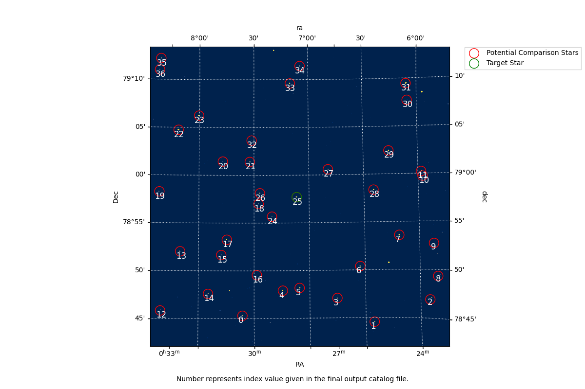
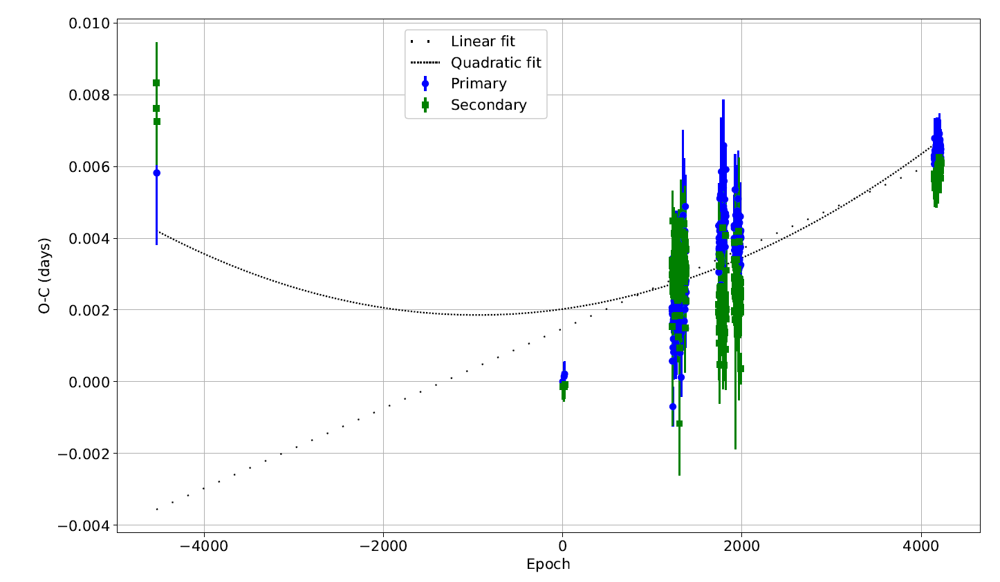
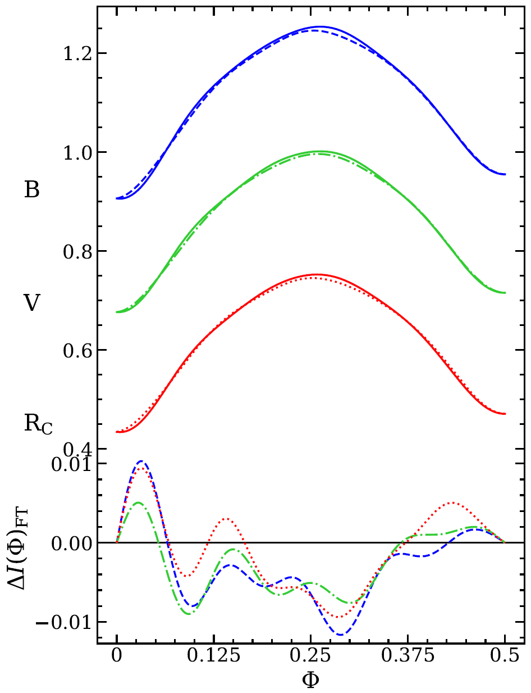
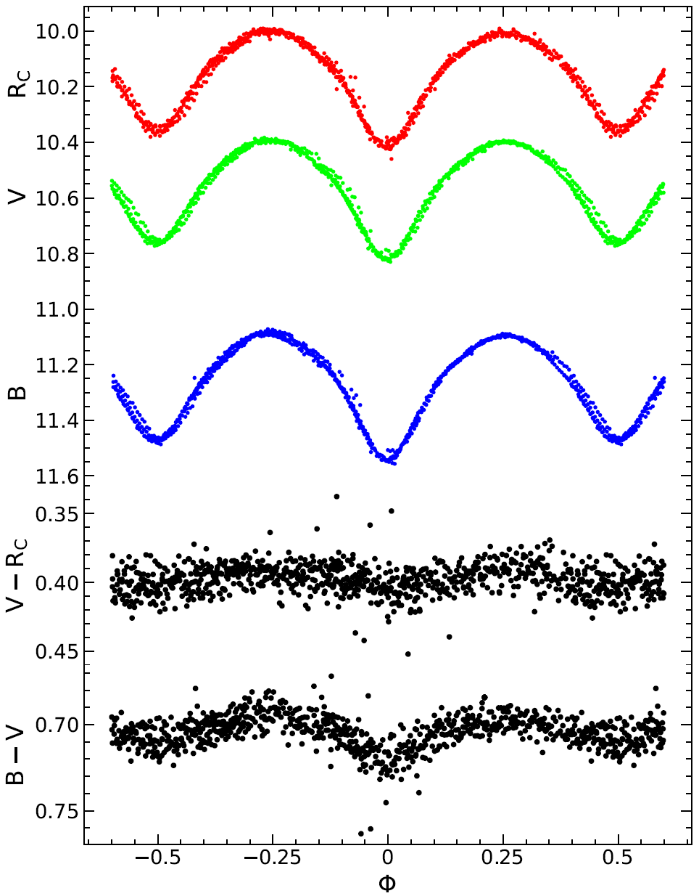
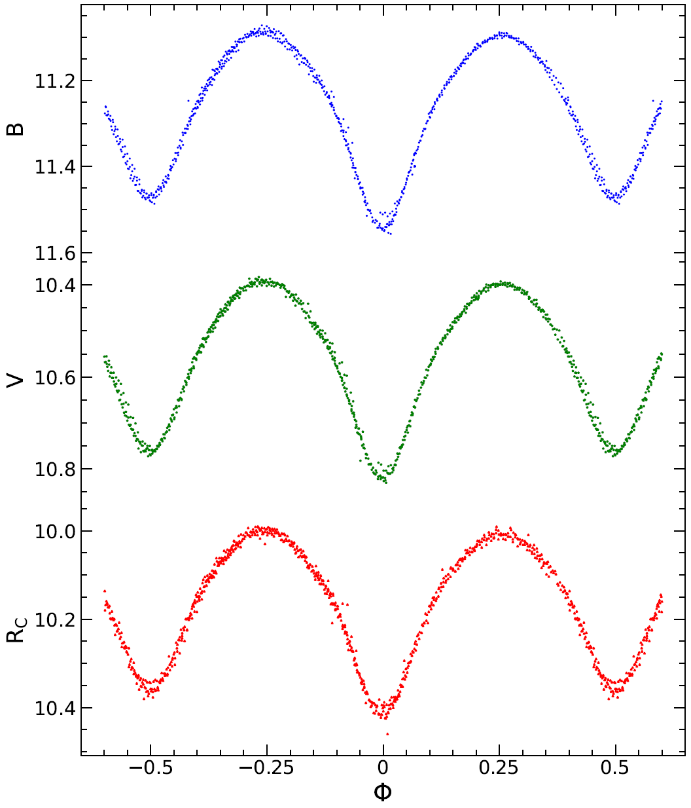

.. _toolbox:

Program Options
===============

.. Important::
    This documentation is not meant to go over all the physics/astronomy or background
    knowledge required to fully understand what the various programs are doing.

Menu
----

After launching EclipsingBinaries as described `here <https://eclipsingbinaries.readthedocs.io/en/latest/EB.html>`_,
the user is presented with a GUI that centralizes all available tools. The left panel
contains the program menu and the right panel displays the inputs and output log for
the selected program.

The available programs are:

+ IRAF Reduction
+ Find Minimum (Work in Progress)
+ TESS Database Search/Download
+ AIJ Comparison Star Selector
+ Multi-Aperture Calculation
+ BSUO or SARA/TESS Night Filters
+ O-C Plotting
+ Gaia Search
+ O'Connell Effect
+ Color Light Curve
+ Close Program

IRAF Reduction
--------------

.. note::
    The pipeline for this program is set up only for use at BSUO. This will be updated
    in the future.

Making heavy use of `Astropy's ccdproc <https://ccdproc.readthedocs.io/en/stable/ccddata.html>`_
and `Photutils <https://photutils.readthedocs.io/en/stable/aperture.html>`_, this program
provides an automatic data reduction process using Bias, Dark, and Flat frames to reduce
science images.

The GUI panel accepts the following inputs:

+ **Raw Images Path** — folder containing the raw, unreduced FITS images
+ **Calibrated Images Path** — folder where reduced images will be saved
+ **Location** — telescope site identifier (e.g. BSUO, CTIO)
+ **Use Dark Frames** — checkbox to include or skip dark frame subtraction
+ **Overscan Region** — format ``[columns, rows]``, e.g. ``[2073:2115, :]``
+ **Trim Region** — format ``[columns, rows]``, e.g. ``[20:2060, 12:2057]``

A **Open Bias Image** button is provided to plot row 1000 of a selected bias frame,
helping the user identify the overscan and trim regions before running the reduction.

.. note::
    For ``ccdproc``, if the same rows are entered for both the overscan and trim region,
    ``ccdproc`` will error out. The recommendation is to use all rows (``:``) for the
    overscan region and specify exact rows only for the trim region.

Default Values
^^^^^^^^^^^^^^

The reduction uses the following default camera parameters which can be overridden
in the GUI:

+ **Gain** — 1.43 e⁻/ADU
+ **Read Noise** — 10.83 e⁻
+ **Memory Limit** — 450 MB (``450e6``)

Reduction Functions
^^^^^^^^^^^^^^^^^^^

The main reduction stages are ``bias``, ``dark``, ``flat``, and ``science``. Each calls
a shared reduction function for the actual image processing:

.. literalinclude:: ../EclipsingBinaries/IRAF_Reduction.py
   :lines: 220-289

Each calibration type (bias, dark, flat, science) has its own section within the
reduction pipeline.

Bias
^^^^

The bias reduction subtracts the overscan and trims each raw bias frame, then
combines them into a master bias using sigma clipping:

.. literalinclude:: ../EclipsingBinaries/IRAF_Reduction.py
   :lines: 292-370

The ``sigma_clip_dev_func`` computes the standard deviation about the central value.
See `ccdproc documentation <https://ccdproc.readthedocs.io/en/stable/api/ccdproc.Combiner.html#ccdproc.Combiner.sigma_clipping>`_
for more details.

Dark
^^^^

Once the master bias is created, dark frames are bias-subtracted and combined into
a master dark. Dark subtraction can be skipped entirely using the **Use Dark Frames**
checkbox, since modern cooled CCDs often have negligible thermal noise.

.. literalinclude:: ../EclipsingBinaries/IRAF_Reduction.py
   :lines: 400-454

Flat
^^^^

The master bias and master dark are subtracted from each flat frame. Master flats
are created per filter:

.. literalinclude:: ../EclipsingBinaries/IRAF_Reduction.py
   :lines: 457-517

Science
^^^^^^^

Science images are bias-subtracted, dark-subtracted, and flat-divided using the
master flat for the matching filter.

Adding to the Header
^^^^^^^^^^^^^^^^^^^^

Each reduced image has the reduction parameters written to its FITS header by the
``add_header`` function:

.. literalinclude:: ../EclipsingBinaries/IRAF_Reduction.py
   :lines: 550-580

BJD_TDB
^^^^^^^

`TESS <https://tess.mit.edu/>`_ uses ``BJD_TDB`` while BSUO and
`SARA <https://www.saraobservatory.org/>`_ use ``HJD``. This conversion is included
to provide a consistent time standard across multiple telescopes and satellites:

.. literalinclude:: ../EclipsingBinaries/IRAF_Reduction.py
   :lines: 583-617

TESS Database Search/Download
------------------------------

TESS is a valuable resource for eclipsing binary research — if a target is in the
database it typically has weeks to months of continuous photometry available.

The GUI panel accepts the following inputs:

+ **System Name** — the TIC ID or common name of the target (e.g. ``NSVS 896797``)
+ **Download Path** — folder where sector data will be saved
+ **Download Specific Sector** — checkbox to select a single sector instead of all available sectors

When **Download Specific Sector** is checked, a **Retrieve Sectors** button appears.
Clicking it queries TESS for available sectors and populates a dropdown for the user
to select from. The sector table is also printed to the output log.

Searching TESS
^^^^^^^^^^^^^^

Given an object name, the program queries TESS for available sector numbers:

.. literalinclude:: ../EclipsingBinaries/tess_data_search.py
   :lines: 29-36

TESS CCD Information
^^^^^^^^^^^^^^^^^^^^

TESS has four onboard CCDs. The gain for each camera/CCD combination is stored in
``tess_ccd_info.txt``, available
`here <https://github.com/kjkoeller/EclipsingBinaries/blob/main/EclipsingBinaries/tess_ccd_info.txt>`_.
The program matches the sector's camera and CCD to the correct gain value:

.. literalinclude:: ../EclipsingBinaries/tess_data_search.py
   :lines: 44-73

Downloading
^^^^^^^^^^^

Sectors are downloaded as ``30x30 arcmin`` cutouts — the maximum size allowed by TESS.
Each sector is saved to its own numbered subdirectory inside the download path:

.. literalinclude:: ../EclipsingBinaries/tess_data_search.py
   :lines: 83-106

.. literalinclude:: ../EclipsingBinaries/tess_data_search.py
   :lines: 111-134

TESSCut
^^^^^^^

The downloaded TESS file is a FITS file containing all images for a given sector.
The ``tesscut.py`` file handles extracting individual images and reading the mid-exposure
time in ``BJD_TDB`` from each image's metadata:

.. literalinclude:: ../EclipsingBinaries/tesscut.py
   :lines: 97-98

.. literalinclude:: ../EclipsingBinaries/tesscut.py
   :lines: 110

BJD to HJD
^^^^^^^^^^

.. literalinclude:: ../EclipsingBinaries/tesscut.py
   :lines: 146-156

Takes ``RA``, ``DEC``, ``BJD_TDB``, and ``location`` as inputs and returns the
light-travel-time corrected ``HJD``.

Header Information
^^^^^^^^^^^^^^^^^^

The following header keywords are added to each extracted image:

.. literalinclude:: ../EclipsingBinaries/tesscut.py
   :lines: 128-132

``LST_UPDT`` records when the file was processed and ``COMMENT`` contains the
observation date, sector number, and other metadata.

AIJ Comparison Star Selector
-----------------------------

Catalog Search
^^^^^^^^^^^^^^

The GUI panel accepts the following inputs:

+ **Right Ascension (RA)** — format ``HH:MM:SS.SSSS``
+ **Declination (DEC)** — format ``DD:MM:SS.SSSS`` or ``-DD:MM:SS.SSSS``
+ **Data Save Folder Path** — where RADEC files will be written
+ **Object Name** — used for output file naming
+ **Science Image Folder Path** — folder containing calibrated science images for the overlay plot

The program queries the `Vizier APASS catalog <https://vizier.cds.unistra.fr/viz-bin/VizieR-3?-source=II/336/apass9>`_
using a 30 arcmin search box centered on the target:

.. literalinclude:: ../EclipsingBinaries/apass.py
   :lines: 189-209

Only stars with Johnson B and V magnitudes below 14 are returned.

Cousins R
^^^^^^^^^

.. note::
    Utilizes GPU acceleration through ``numba`` for the ``calculations`` function.

The Cousins R magnitude for each comparison star is calculated using the equation
from `Jester et al. 2005 <https://arxiv.org/pdf/astro-ph/0609736.pdf>`_:

.. literalinclude:: ../EclipsingBinaries/apass.py
   :lines: 526-539

.. literalinclude:: ../EclipsingBinaries/examples/APASS_Catalog_ex.txt
    :lines: 1-10

Gaia
^^^^

The comparison star selection also queries the
`Gaia DR3 <https://www.cosmos.esa.int/web/gaia/data-release-3>`_ catalog to calculate
TESS magnitudes for each comparison star. References:

+ https://iopscience.iop.org/article/10.3847/1538-3881/acaaa7/pdf
+ https://iopscience.iop.org/article/10.3847/1538-3881/ab3467/pdf
+ https://arxiv.org/pdf/2012.01916.pdf
+ https://arxiv.org/pdf/2301.03704

.. literalinclude:: ../EclipsingBinaries/gaia.py
   :lines: 102-165

If the TESS magnitude for a comparison star cannot be determined, its value and error
are set to ``99.999`` so it will not be selected as a comparison star.

Creating RADEC Files
^^^^^^^^^^^^^^^^^^^^

Four RADEC files are created — one each for Johnson B, Johnson V, Cousins R, and TESS —
using Astro ImageJ (AIJ) formatting:

.. literalinclude:: ../EclipsingBinaries/apass.py
   :lines: 383-434

Overlay
^^^^^^^

An optional overlay plot shows the locations of all comparison stars on a science image,
with circles and index numbers marking each star:

.. literalinclude:: ../EclipsingBinaries/apass.py
   :lines: 437-500

BSUO or SARA/TESS Night Filters
---------------------------------

When using Astro ImageJ (AIJ), it produces ``.dat`` files containing magnitude and
flux data for each night of observations. This program combines all nightly files
into a single file per filter.

The program checks whether the ``.dat`` files contain five columns (magnitude only)
or seven columns (magnitude and flux) and writes the combined output accordingly:

.. literalinclude:: ../EclipsingBinaries/examples/test_B.txt
    :lines: 1-15

O-C Plotting
------------

The O-C plotting panel calculates Observed minus Calculated (O-C) values given a
period and times of minimum (ToM), then fits linear and quadratic models to the data.

The GUI panel offers three modes selected by radio buttons:

+ **BSUO/SARA** — averages ToM across Johnson B, V, and Cousins R filters
+ **TESS** — processes a single TESS ToM file
+ **All Data** — merges multiple pre-calculated O-C files into one combined dataset

Common inputs across all modes:

+ **Period** — orbital period of the system in days
+ **Output Folder** — where all output files will be saved
+ **I already have an Epoch value** — checkbox to enter a known T0 and its error;
  if unchecked the first ToM in the data is used as T0

BSUO/SARA
^^^^^^^^^

Requires three ToM files, one per filter (B, V, R). The program averages the three
filters for each epoch:

.. literalinclude:: ../EclipsingBinaries/OC_plot.py
   :lines: 159-162

TESS
^^^^

Requires a single ToM file. No averaging is performed as only one filter is available.

All Data
^^^^^^^^

.. note::
    All input files must follow the format shown in
    `example_OC_table.txt <https://github.com/kjkoeller/EclipsingBinaries/blob/main/EclipsingBinaries/examples/example_OC_table.txt>`_.

Accepts a comma-separated list of pre-calculated O-C files and merges them into a
single output. A LaTeX-formatted table is also produced automatically:

.. literalinclude:: ../EclipsingBinaries/examples/O-C_paper_table.txt

Calculations
^^^^^^^^^^^^

The core O-C calculation is handled by the ``calculate_oc`` function:

.. literalinclude:: ../EclipsingBinaries/OC_plot.py
   :lines: 304-334

The `Numba <https://numba.pydata.org/>`_ ``@jit`` decorator accelerates this function.
The eclipse number is determined using floor (positive epoch) or ceiling (negative epoch),
and O-C values are rounded to five decimal places.

.. literalinclude:: ../EclipsingBinaries/examples/example_OC_table.txt
    :lines: 1-10

Fitting and Output
^^^^^^^^^^^^^^^^^^

After calculating O-C values, ``data_fit`` performs both a linear and quadratic weighted
least squares fit. Output files written to the output folder:

+ ``[mode]_OC.txt`` — the O-C data table
+ ``[mode]_OC.png`` — the O-C plot with linear and quadratic fits
+ ``[mode]_OC.tex`` — regression tables formatted for LaTeX

The linear fit is used to calculate a period correction:

.. literalinclude:: ../EclipsingBinaries/examples/example_regression.txt
    :lines: 1-32

Gaia Search
-----------

Query
^^^^^

Some Gaia functionality is described in the
`AIJ Comparison Star Selector section <https://eclipsingbinaries.readthedocs.io/en/latest/toolbox.html#gaia>`_.
The Gaia Search panel queries Gaia DR3 for physical parameters of a target star.

The GUI panel accepts the following inputs:

+ **Right Ascension (RA)** — format ``HH:MM:SS.SSSS``
+ **Declination (DEC)** — format ``DD:MM:SS.SSSS`` or ``-DD:MM:SS.SSSS``
+ **Output File Path** — folder where the results CSV will be saved

The query returns the top four matches within a 5 arcsecond search cone and saves
the following parameters:

+ Parallax and error
+ Distance (lower, central, upper)
+ Effective temperature (lower, central, upper)
+ Gaia G, BP, and RP magnitudes
+ Radial velocity and error

.. literalinclude:: ../EclipsingBinaries/gaia.py
   :lines: 40-61

.. literalinclude:: ../EclipsingBinaries/gaia.py
   :lines: 64-88

.. literalinclude:: ../EclipsingBinaries/examples/Gaia_output.txt

.. note::
    Parameters with a value of ``1e+20`` indicate that Gaia does not have data for
    that parameter for the given star. Full parameter descriptions are available at the
    `Gaia archive documentation <https://gea.esac.esa.int/archive/documentation/GDR3/Gaia_archive/chap_datamodel/sec_dm_main_source_catalogue/ssec_dm_gaia_source.html>`_.

O'Connell Effect
----------------

.. note::
    Based on this `paper <https://app.aavso.org/jaavso/article/3511/>`_ and originally
    created by Alec J. Neal.

The GUI panel accepts the following inputs:

+ **Number of Filters** — radio buttons to select 1, 2, or 3 filters
+ **File Path(s)** — one file per selected filter (Johnson B, V, Cousins R)
+ **HJD** — reference epoch (first primary ToM)
+ **Period** — orbital period in days
+ **System Name** — used for output file naming
+ **Output File Path** — folder where results will be saved

Calculations
^^^^^^^^^^^^

Magnitude data is converted to flux and phased using the period:

.. literalinclude:: ../EclipsingBinaries/OConnell.py
   :lines: 113-120

The first and second halves of the phased light curve are compared:

.. literalinclude:: ../EclipsingBinaries/OConnell.py
   :lines: 126-137

Statistical values (OER, LCA, ΔI) are calculated for each filter using Monte Carlo
simulations (1000 by default):

.. literalinclude:: ../EclipsingBinaries/OConnell.py
   :lines: 298-328

See `vseq_updated.py <https://github.com/kjkoeller/EclipsingBinaries/blob/main/EclipsingBinaries/vseq_updated.py#L1114>`_
for the full mathematical implementations.

Output
^^^^^^

A LaTeX-formatted table is produced containing all statistical values for each filter:

.. literalinclude:: ../EclipsingBinaries/examples/OConnell_table.txt

Color Light Curve
-----------------

.. note::
    Originally created by Alec J. Neal, updated for this package by Kyle Koeller.

The Color Light Curve panel calculates B-V and optionally V-R color indices and
effective temperatures from multi-filter light curve data.

The GUI panel accepts the following inputs:

+ **B-band File** — Johnson B light curve file
+ **V-band File** — Johnson V light curve file
+ **Period** — orbital period in days
+ **HJD (Epoch)** — first primary ToM
+ **Output Image Name** — filename for the saved plot (must end in ``.png``)

Subtract Light Curve
^^^^^^^^^^^^^^^^^^^^

The ``subtract_LC`` function interpolates the B-band observations to the times of
V-band observations, then calculates the instantaneous B-V color index:

.. literalinclude:: ../EclipsingBinaries/color_light_curve.py
   :lines: 86-143

The effective temperature is derived from the color index using the polynomial fit
from `Flower 1996 <https://ui.adsabs.harvard.edu/abs/1996ApJ...469..355F/abstract>`_
with the Torres 2010 update:

.. literalinclude:: ../EclipsingBinaries/vseq_updated.py
   :lines: 1499-1507

.. note::
    The B-V polynomial is the one Flower specifically derived. Using the same polynomial
    for V-R is an approximation and should be treated with caution.

Plotting
^^^^^^^^

The output log displays the color index, its error, and the derived effective temperature.
The plot shows the phased light curves in the upper panel and the color index variation
in the lower panel:

