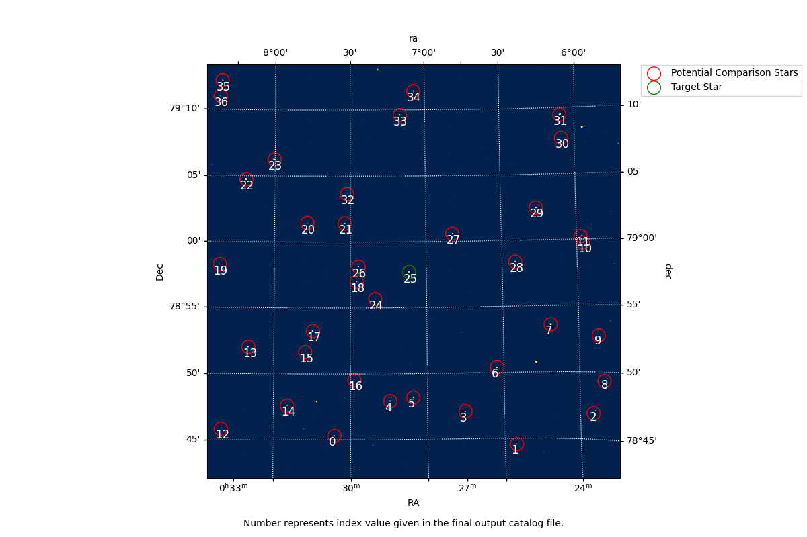
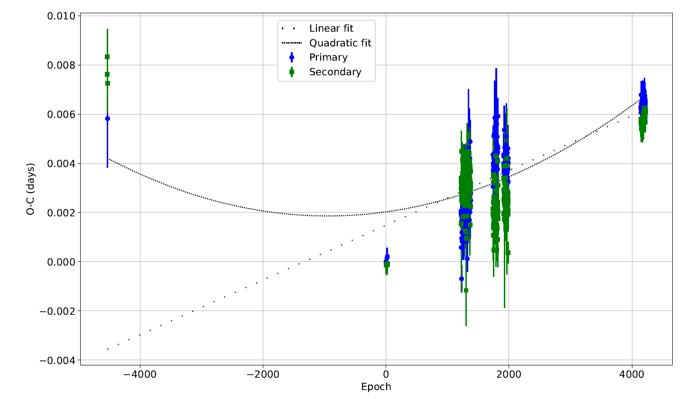
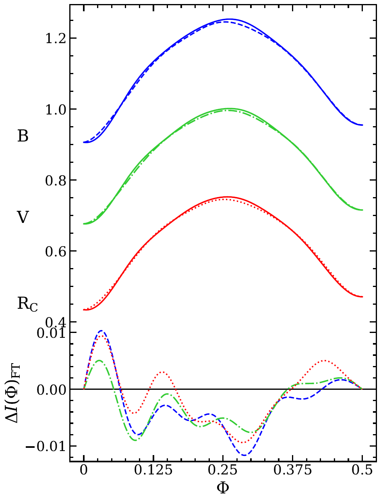
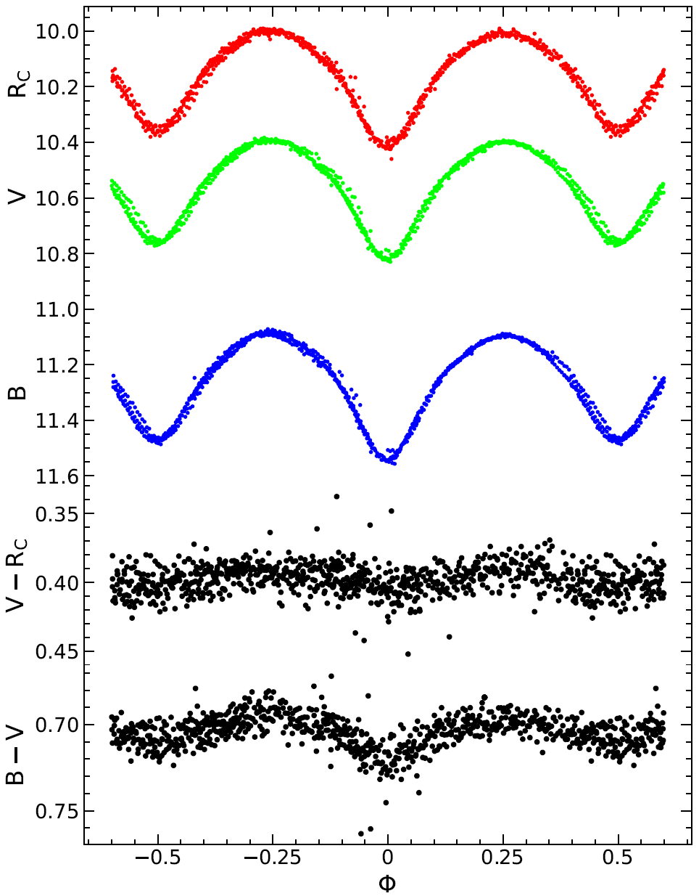
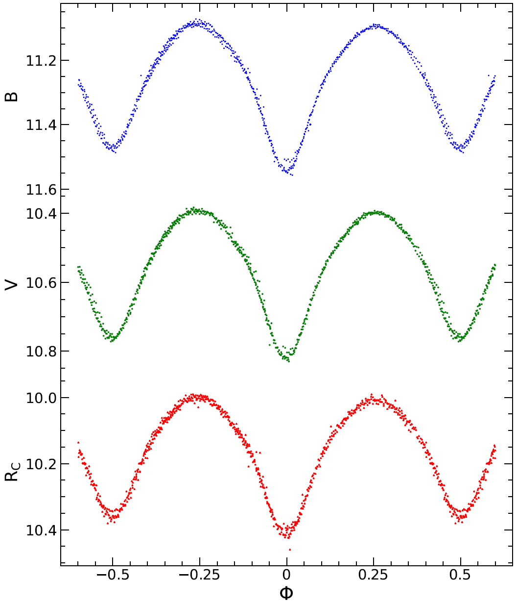

.. _toolbox:

Program Options
===============

.. Important::
    This documentation is not meant to go over all the physics/astronomy or background
    knowledge required to fully understand what the various programs are doing.

Menu
----

After launching EclipsingBinaries as described in :ref:`EB`,
the user is presented with a GUI that centralizes all available tools. The left panel
contains the program menu and the right panel displays the inputs and output log for
the selected program.

The available programs are:

+ IRAF Reduction
+ Find Minimum (work in progress; run ``python -m EclipsingBinaries.find_min`` from a terminal for now)
+ TESS Database Search/Download
+ AIJ Comparison Star Selector
+ Multi-Aperture Calculation
+ BSUO or SARA/TESS Night Filters (see the note in that section)
+ O-C Plotting
+ Gaia Search
+ O'Connell Effect
+ Color Light Curve
+ Close Program

IRAF Reduction
--------------

Making heavy use of `Astropy's ccdproc <https://ccdproc.readthedocs.io/en/stable/ccddata.html>`_,
this program provides an automatic data reduction process using Bias, Dark, and Flat frames
to reduce science images.

The GUI panel accepts the following inputs:

+ **Raw Images Path** — folder containing the raw, unreduced FITS images
+ **Calibrated Images Path** — folder where reduced images will be saved (created if missing)
+ **Location** — telescope site. Leave it empty for BSUO. See `Camera Presets`_ below.
+ **Use Dark Frames** — checkbox to include or skip dark frame subtraction
+ **Overscan Region** — format ``[columns, rows]``. Leave it empty for the BSUO default
  ``[2073:2115, :]``, or enter ``none`` to skip overscan subtraction.
+ **Trim Region** — format ``[columns, rows]``. Leave it empty for the BSUO default
  ``[20:2060, 12:2057]``.

The **Open Bias Image** button plots the counts along the middle row of a selected bias
frame in its own window, with the matplotlib toolbar for zooming. Use it to find where the
overscan begins before running the reduction. The dashed "suggested start of overscan" line
is drawn at column 2077, the BSUO camera value, and only when the image is wide enough.

.. note::
    For ``ccdproc``, if the same rows are entered for both the overscan and trim region,
    ``ccdproc`` will error out. The recommendation is to use all rows (``:``) for the
    overscan region and specify exact rows only for the trim region.

Each run writes ``reduction_config.json`` (the settings used) and ``reduction_summary.txt``
(per-stage counts and any per-frame failures) to the calibrated images folder.

Camera Presets
^^^^^^^^^^^^^^

The **Location** value picks the camera gain and read noise used for the reduction:

=============  =============  ===============
Location       Gain (e⁻/ADU)  Read noise (e⁻)
=============  =============  ===============
``BSUO``       1.43           10.83
``KPNO``       2.3            6.0
``CTIO``       2.0            9.7
``LaPalma``    1.0            6.3
=============  =============  ===============

Case and spaces are ignored, so ``La Palma`` and ``kpno`` work too. Any other site name
uses the BSUO camera values. From Python, ``site_config`` builds the same settings and
accepts overrides for any ``ReductionConfig`` field:

.. code-block:: python

    from EclipsingBinaries.IRAF_Reduction import run_reduction, site_config

    cfg = site_config("KPNO", rdnoise=5.5, dark_bool=False)
    run_reduction("raw_images", "calibrated_images", cfg=cfg)

The memory limit for combining frames defaults to 1.6 GB in ``ReductionConfig``
(``mem_limit``). The ``EB_pipeline`` command uses 450 MB unless ``--mem`` is given.

Reduction Functions
^^^^^^^^^^^^^^^^^^^

The main reduction stages are ``bias``, ``dark``, ``flat``, and ``science_images``. Every
frame first goes through the same preprocessing step: overscan subtraction (unless the
overscan region is ``none``), trimming, then conversion to electrons using the gain:

.. literalinclude:: ../EclipsingBinaries/IRAF_Reduction.py
   :pyobject: _preprocess

Bias
^^^^

The bias reduction subtracts the overscan and trims each raw bias frame, then
combines them into a master bias using sigma clipping:

.. literalinclude:: ../EclipsingBinaries/IRAF_Reduction.py
   :pyobject: bias

The ``sigma_clip_dev_func`` computes the standard deviation about the central value.
See `ccdproc documentation <https://ccdproc.readthedocs.io/en/stable/api/ccdproc.Combiner.html#ccdproc.Combiner.sigma_clipping>`_
for more details.

Dark
^^^^

Once the master bias is created, dark frames are bias-subtracted and combined into
a master dark. Dark subtraction can be skipped entirely using the **Use Dark Frames**
checkbox, since modern cooled CCDs often have negligible thermal noise.

.. literalinclude:: ../EclipsingBinaries/IRAF_Reduction.py
   :pyobject: dark

Flat
^^^^

The master bias and master dark are subtracted from each flat frame. Master flats
are created per filter:

.. literalinclude:: ../EclipsingBinaries/IRAF_Reduction.py
   :pyobject: flat

Science
^^^^^^^

Science images are bias-subtracted, dark-subtracted, and flat-divided using the
master flat for the matching filter:

.. literalinclude:: ../EclipsingBinaries/IRAF_Reduction.py
   :pyobject: _reduce_science

``science_images`` runs that step over every ``LIGHT`` frame and records any frames that
fail without stopping the rest:

.. literalinclude:: ../EclipsingBinaries/IRAF_Reduction.py
   :pyobject: science_images

Adding to the Header
^^^^^^^^^^^^^^^^^^^^

Each reduced image has the reduction parameters written to its FITS header by the
``add_header`` function:

.. literalinclude:: ../EclipsingBinaries/IRAF_Reduction.py
   :pyobject: add_header

Header Correction
^^^^^^^^^^^^^^^^^

`TESS <https://tess.mit.edu/>`_ uses ``BJD_TDB`` while BSUO and
`SARA <https://www.saraobservatory.org/>`_ use ``HJD``. After each science frame is
calibrated, the time and position keywords are corrected so every telescope and satellite
ends up on the same standards. This is a refactor of Robert Berrington's (BSU)
``header-correct.py`` script and writes:

+ ``JD_START``, ``JD_MID``, ``JD_END`` and ``JD``
+ ``HJD`` and ``HJD_UTC`` at mid-exposure
+ ``BJD_UTC`` and ``BJD_TDB`` at mid-exposure
+ Mean and apparent sidereal time
+ ``SECZ`` and ``EAIRMASS`` (IRAF's effective airmass formula)
+ RA/DEC rewritten in IRAF sexagesimal format

Each correction can be turned off with the ``correct_*`` fields of ``ReductionConfig``
(``correct_jd``, ``correct_hjd``, ``correct_bjd``, ``correct_sidereal``,
``correct_eairmass``, ``correct_filter_spaces``), or all at once with
``correct_headers=False``. The BJD calculation:

.. literalinclude:: ../EclipsingBinaries/headerCorrect.py
   :pyobject: _write_bjd

The observatory is read from the ``OBSERVAT`` header keyword. These sites are built in and
need no internet connection:

+ ``BSUO``, ``BSU`` and ``SFRO`` — coordinates from the BSU Cooper Science Observatory record
+ ``KPNO``, ``CTIO`` and ``LAPALMA``, plus the SARA sites that map to them (``SARA-KP``,
  ``SARA-N``, ``SARA-CT``, ``SARA-S``, ``SARA-RM``) — coordinates copied from
  `astropy's site registry <https://github.com/astropy/astropy-data/blob/gh-pages/coordinates/sites.json>`_

If ``OBSERVAT`` is missing or names a site that isn't known, the reduction falls back to
the **Location** setting and notes it in the log. Calling ``correct_headers`` directly falls
back to ``BSU`` instead. To add your own site:

.. code-block:: python

    from EclipsingBinaries.headerCorrect import ObservatoryRegistry, ObservatorySite, correct_headers

    registry = ObservatoryRegistry()
    registry.register(ObservatorySite(name="MYOBS", lat="41:30:00", lon="-87:00:00", altitude_m=200.0))
    correct_headers("image.fits", registry=registry)

``correct_headers_batch`` does the same for a list of files.

TESS Database Search/Download
------------------------------

TESS is a valuable resource for eclipsing binary research — if a target is in the
database it typically has weeks to months of continuous photometry available.

The GUI panel accepts the following inputs:

+ **System Name** — the TIC ID or common name of the target (e.g. ``NSVS 896797``)
+ **Download Path** — folder where sector data will be saved
+ **Download Specific Sector** — checkbox to select a single sector instead of all available sectors

When **Download Specific Sector** is checked, a **Retrieve Sectors** button appears.
Clicking it queries TESS for available sectors and populates a dropdown for the user
to select from. The sector table is also printed to the output log.

Searching TESS
^^^^^^^^^^^^^^

Given an object name, the program queries TESS for available sector numbers:

.. literalinclude:: ../EclipsingBinaries/tess_data_search.py
   :pyobject: run_tess_search

Downloading
^^^^^^^^^^^

Sectors are downloaded as ``30x30 arcmin`` cutouts — the maximum size allowed by TESS.
Each sector is saved to its own numbered subdirectory inside the download path:

.. literalinclude:: ../EclipsingBinaries/tess_data_search.py
   :pyobject: download_sector

TESSCut
^^^^^^^

The downloaded TESS file is a FITS file containing all images for a given sector.
The ``tesscut.py`` file handles extracting individual images and reading the mid-exposure
time in ``BJD_TDB`` from each image's metadata:

.. literalinclude:: ../EclipsingBinaries/tesscut.py
   :pyobject: process_tess_cutout

BJD to HJD
^^^^^^^^^^

.. literalinclude:: ../EclipsingBinaries/tesscut.py
   :pyobject: bary_to_helio

Takes ``RA``, ``DEC``, ``BJD_TDB``, and an astropy site name as inputs and returns the
light-travel-time corrected ``HJD``. TESS cutouts use ``greenwich``, which ships with
astropy, so no download is needed.

AIJ Comparison Star Selector
-----------------------------

Catalog Search
^^^^^^^^^^^^^^

The GUI panel accepts the following inputs:

+ **Right Ascension (RA)** — format ``HH:MM:SS.SSSS``
+ **Declination (DEC)** — format ``DD:MM:SS.SSSS`` or ``-DD:MM:SS.SSSS``
+ **Data Save Folder Path** — where RADEC files will be written
+ **Object Name** — used for output file naming
+ **Science Image File** — a calibrated science image for the overlay plot. A folder also
  works, in which case the first FITS file in it is used.

The program queries the `Vizier APASS catalog <https://vizier.cds.unistra.fr/viz-bin/VizieR-3?-source=II/336/apass9>`_
using a 30 arcmin search box centered on the target:

.. literalinclude:: ../EclipsingBinaries/apass.py
   :pyobject: comparison_selector

Only stars with Johnson B and V magnitudes below 14 are returned.

Cousins R
^^^^^^^^^

The Cousins R magnitude for each comparison star is calculated using the equation
from `Jester et al. 2005 <https://arxiv.org/pdf/astro-ph/0609736.pdf>`_:

.. literalinclude:: ../EclipsingBinaries/apass.py
   :pyobject: calculations

.. literalinclude:: ../EclipsingBinaries/examples/APASS_Catalog_ex.txt
    :language: text
    :lines: 1-10

Gaia
^^^^

The comparison star selection also queries the
`Gaia DR3 <https://www.cosmos.esa.int/web/gaia/data-release-3>`_ catalog to calculate
TESS magnitudes for each comparison star. References:

+ https://iopscience.iop.org/article/10.3847/1538-3881/acaaa7/pdf
+ https://iopscience.iop.org/article/10.3847/1538-3881/ab3467/pdf
+ https://arxiv.org/pdf/2012.01916.pdf
+ https://arxiv.org/pdf/2301.03704

.. literalinclude:: ../EclipsingBinaries/gaia.py
   :pyobject: tess_mag

If the TESS magnitude for a comparison star cannot be determined, its value and error
are set to ``99.999`` so it will not be selected as a comparison star.

Creating RADEC Files
^^^^^^^^^^^^^^^^^^^^

Four RADEC files are created — one each for Johnson B, Johnson V, Cousins R, and TESS —
using Astro ImageJ (AIJ) formatting:

.. literalinclude:: ../EclipsingBinaries/apass.py
   :pyobject: create_radec

Overlay
^^^^^^^

An optional overlay plot shows the locations of all comparison stars on a science image,
with circles and index numbers marking each star:

.. literalinclude:: ../EclipsingBinaries/apass.py
   :pyobject: overlay

Multi-Aperture Calculation
--------------------------

Runs aperture photometry on reduced science images for Johnson B, V and Cousins R, using
the target and comparison stars from the RADEC files made by the
`AIJ Comparison Star Selector`_. It uses `Photutils <https://photutils.readthedocs.io/en/stable/aperture.html>`_
apertures and annuli, and the target magnitude is calibrated against the ensemble of
comparison stars.

The GUI panel accepts the following inputs:

+ **Object Name** — used for output file naming
+ **Reduced Images Path** — folder of calibrated ``LIGHT`` frames
+ **RADEC File (B/V/R Filter)** — one RADEC file per filter. The first row is the target
  and the rest are comparison stars.
+ **Aperture Radius**, **Inner Annulus Radius**, **Outer Annulus Radius** — in pixels.
  Leave them empty for 20, 30 and 50.

Images are grouped by the ``FILTER`` keyword. ``Empty/B`` and ``B`` style names work out
of the box; other names need a ``filter_config.json`` as described in
:ref:`custom-filter-mapping`.

Optimize Radii
^^^^^^^^^^^^^^

The **Optimize Radii** button loads the first ``LIGHT`` frame and the target position from
the first RADEC file given, fits a 2D Gaussian to estimate the FWHM, and picks the
aperture radius with the best signal-to-noise:

.. literalinclude:: ../EclipsingBinaries/multi_aperture_photometry.py
   :pyobject: auto_optimize_radii

A window then opens with a cutout of the target and sliders for the aperture radius,
inner annulus radius and annulus width. The SNR and the annulus-to-aperture area ratio
update as you drag. **Save & Close** copies the chosen radii back into the panel.

Output
^^^^^^

For each filter, two files are written to the reduced images folder:

+ ``[name]_[filter]_data.csv`` — columns ``HJD``, ``BJD``, ``Source_AMag_T1`` and
  ``Source_AMag_T1_Error``
+ ``[name]_[filter]_figure.jpg`` — the light curve with error bars

BSUO or SARA/TESS Night Filters
---------------------------------

.. note::
    The **BSUO or SARA/TESS Night Filters** button in the GUI isn't wired up yet. Run the
    program from a terminal instead with ``python -m EclipsingBinaries.Night_Filters``,
    which asks for the number of nights and each file path.

When using Astro ImageJ (AIJ), it produces ``.dat`` files containing magnitude and
flux data for each night of observations. This program combines all nightly files
into a single file per filter.

The program checks whether the ``.dat`` files contain five columns (magnitude only)
or seven columns (magnitude and flux) and writes the combined output accordingly:

.. literalinclude:: ../EclipsingBinaries/examples/test_B.txt
    :language: text
    :lines: 1-15

O-C Plotting
------------

The O-C plotting panel calculates Observed minus Calculated (O-C) values given a
period and times of minimum (ToM), then fits linear and quadratic models to the data.

The GUI panel offers three modes selected by radio buttons:

+ **BSUO/SARA** — averages ToM across Johnson B, V, and Cousins R filters
+ **TESS** — processes a single TESS ToM file
+ **All Data** — merges multiple pre-calculated O-C files into one combined dataset

Common inputs across all modes:

+ **Period** — orbital period of the system in days
+ **Output Folder** — where all output files will be saved
+ **I already have an Epoch value** — checkbox to enter a known T0 and its error;
  if unchecked the first ToM in the data is used as T0. Hidden in All Data mode, which
  doesn't use an epoch.

Only the inputs for the selected mode are shown.

BSUO/SARA
^^^^^^^^^

Requires three ToM files, one per filter (B, V, R). The program averages the three
filters for each epoch:

.. literalinclude:: ../EclipsingBinaries/OC_plot.py
   :pyobject: BSUO

TESS
^^^^

Requires a single ToM file. No averaging is performed as only one filter is available:

.. literalinclude:: ../EclipsingBinaries/OC_plot.py
   :pyobject: TESS_OC

All Data
^^^^^^^^

.. note::
    All input files must follow the format shown in
    `example_OC_table.txt <https://github.com/kjkoeller/EclipsingBinaries/blob/main/EclipsingBinaries/examples/example_OC_table.txt>`_.

Enter the **Number of Files** and the **O-C Files** as a comma-separated list of paths.
The files are merged into ``all_data_OC.txt`` and a LaTeX-formatted table is produced:

.. literalinclude:: ../EclipsingBinaries/OC_plot.py
   :pyobject: all_data

.. literalinclude:: ../EclipsingBinaries/examples/O-C_paper_table.txt
    :language: text

Calculations
^^^^^^^^^^^^

The core O-C calculation is handled by the ``calculate_oc`` function:

.. literalinclude:: ../EclipsingBinaries/OC_plot.py
   :pyobject: calculate_oc

The eclipse number is determined using floor (positive epoch) or ceiling (negative epoch),
and O-C values are rounded to five decimal places.

.. literalinclude:: ../EclipsingBinaries/examples/example_OC_table.txt
    :language: text
    :lines: 1-10

Fitting and Output
^^^^^^^^^^^^^^^^^^

After calculating O-C values, ``data_fit`` performs both a linear and quadratic weighted
least squares fit. Output files written to the output folder:

+ ``[mode]_OC.txt`` — the O-C data table
+ ``[mode]_OC.png`` — the O-C plot with linear and quadratic fits
+ ``[mode]_OC.tex`` — regression tables formatted for LaTeX

.. literalinclude:: ../EclipsingBinaries/OC_plot.py
   :pyobject: data_fit

.. literalinclude:: ../EclipsingBinaries/examples/example_regression.txt
    :language: text
    :lines: 1-32

Gaia Search
-----------

Query
^^^^^

Some Gaia functionality is described in the
`AIJ Comparison Star Selector section <https://eclipsingbinaries.readthedocs.io/en/latest/toolbox.html#gaia>`_.
The Gaia Search panel queries Gaia DR3 for physical parameters of a target star.

The GUI panel accepts the following inputs:

+ **Right Ascension (RA)** — format ``HH:MM:SS.SSSS``
+ **Declination (DEC)** — format ``DD:MM:SS.SSSS`` or ``-DD:MM:SS.SSSS``
+ **Output Folder** — folder where ``gaia_results.csv`` will be saved

The query returns the top four matches within a 5 arcsecond search cone and saves
the following parameters:

+ Parallax and error
+ Distance (lower, central, upper)
+ Effective temperature (lower, central, upper)
+ Gaia G, BP, and RP magnitudes
+ Radial velocity and error

.. literalinclude:: ../EclipsingBinaries/gaia.py
   :pyobject: target_star

.. literalinclude:: ../EclipsingBinaries/examples/Gaia_output.txt
    :language: text

.. note::
    Parameters with a value of ``1e+20`` indicate that Gaia does not have data for
    that parameter for the given star. Full parameter descriptions are available at the
    `Gaia archive documentation <https://gea.esac.esa.int/archive/documentation/GDR3/Gaia_archive/chap_datamodel/sec_dm_main_source_catalogue/ssec_dm_gaia_source.html>`_.

O'Connell Effect
----------------

.. note::
    Based on this `paper <https://app.aavso.org/jaavso/article/3511/>`_ and originally
    created by Alec J. Neal.

The GUI panel accepts the following inputs:

+ **Number of Filters** — radio buttons to select 1, 2, or 3 filters
+ **File Path(s)** — one file per selected filter (Johnson B, V, Cousins R)
+ **HJD** — reference epoch (first primary ToM)
+ **Period** — orbital period in days
+ **System Name** — used for output file naming
+ **Output Folder** — folder where results will be saved

The plot is saved as ``[System Name].pdf`` and the LaTeX table as ``[System Name].txt`` in
the output folder. The fitted parameters (a1, a2, a4, OER, LCA, ΔI) are also written to the
output log.

Calculations
^^^^^^^^^^^^

Magnitude data is converted to flux and phased using the period. The first and second
halves of the phased light curve are then compared:

.. literalinclude:: ../EclipsingBinaries/OConnell.py
   :pyobject: Half_Comp

Statistical values (OER, LCA, ΔI) are calculated for each filter using Monte Carlo
simulations (1000 by default):

.. literalinclude:: ../EclipsingBinaries/OConnell.py
   :pyobject: OConnell_total

See `vseq_updated.py <https://github.com/kjkoeller/EclipsingBinaries/blob/main/EclipsingBinaries/vseq_updated.py#L1114>`_
for the full mathematical implementations.

Output
^^^^^^

A LaTeX-formatted table is produced containing all statistical values for each filter:

.. literalinclude:: ../EclipsingBinaries/OConnell.py
   :pyobject: multi_OConnell_total

.. literalinclude:: ../EclipsingBinaries/examples/OConnell_table.txt
    :language: text

Color Light Curve
-----------------

.. note::
    Originally created by Alec J. Neal, updated for this package by Kyle Koeller.

The Color Light Curve panel calculates B-V and optionally V-R color indices and
effective temperatures from multi-filter light curve data.

The GUI panel accepts the following inputs:

+ **B-band File** — Johnson B light curve file
+ **V-band File** — Johnson V light curve file
+ **Period** — orbital period in days
+ **HJD (Epoch)** — first primary ToM
+ **Output Image Name** — filename for the saved plot (must end in ``.png``). Leave it empty
  for ``color_curve.png``. A bare file name is saved in the folder you launched
  ``EclipsingBinaries`` from, so give a full path to save it elsewhere.

Subtract Light Curve
^^^^^^^^^^^^^^^^^^^^

The ``subtract_LC`` function interpolates the B-band observations to the times of
V-band observations, then calculates the instantaneous B-V color index:

.. literalinclude:: ../EclipsingBinaries/color_light_curve.py
   :pyobject: subtract_LC

The effective temperature is derived from the color index using the polynomial fit
from `Flower 1996 <https://ui.adsabs.harvard.edu/abs/1996ApJ...469..355F/abstract>`_
with the Torres 2010 update:

.. literalinclude:: ../EclipsingBinaries/vseq_updated.py
   :pyobject: Flower.T.Teff

.. note::
    The B-V polynomial is the one Flower specifically derived. Using the same polynomial
    for V-R is an approximation and should be treated with caution.

Plotting
^^^^^^^^

The output log displays the color index, its error, and the derived effective temperature.
The plot shows the phased light curves in the upper panel and the color index variation
in the lower panel:

.. literalinclude:: ../EclipsingBinaries/color_light_curve.py
   :pyobject: color_plot

